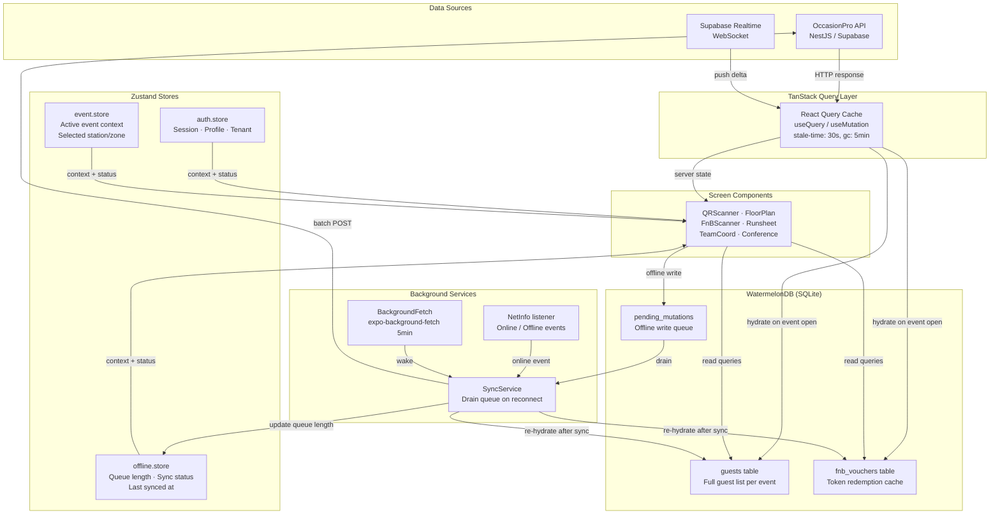

# OccasionPro iOS App — Phase 2 Architecture

**Document version:** 1.0  
**Date:** 2026-05-18  
**Status:** Approved for implementation  
**Owner:** Mobile Engineering

---

## 1. Phase 1 Recap

Phase 1 delivered the core Expo React Native foundation across **8 functional screens**, establishing auth, navigation, and real-time data foundations. These screens are live and used for basic event-day operations.

### Phase 1 Screen Inventory

| Screen | Route | Purpose |
|--------|-------|---------|
| Login / Signup / Forgot | `(auth)/login` `signup` `forgot-password` | Email/password auth via Supabase |
| Dashboard | `(tabs)/index` | KPI overview, upcoming events, quick actions |
| Events List | `(tabs)/events` | Paginated event cards, search, status filter |
| Event Detail | `events/[id]/index` | Full event info, status, team summary |
| Guest List | `events/[id]/guests` | Guest table with check-in status, category filter |
| QR Check-In | `events/[id]/checkin` | Live QR scan via expo-camera, vibrate/flash feedback |
| Runsheet | `events/[id]/runsheet` | Timeline view, realtime item status via TanStack Query |
| Notifications | `events/[id]/notifications` | Event-scoped push notifications list |
| Kiosk | `kiosk/index` | Standalone kiosk mode for entrance tables |

### Phase 1 Tech Stack (confirmed production)

```
Expo ~51 / expo-router ~3.5 (file-based navigation)
React Native 0.74
Zustand ^4.5 (local state — auth.store.ts)
@tanstack/react-query ^5.45 (server state + caching)
expo-camera ~15 (QR scanning in checkin.tsx)
expo-notifications ~0.28 (FCM + APNs via device_tokens table)
expo-secure-store (JWT persistence)
nativewind ^4 (TailwindCSS-style styling)
supabase-js ^2.43 (auth + Realtime subscriptions)
```

---

## 2. Phase 2 Goal

**Achieve feature parity with the web platform for on-ground event-day operations.**

Phase 2 focuses exclusively on event execution: F&B token redemption, walk-in payments, floor plan navigation, vendor check-in, conference live feed, badge printing, team coordination, and guest self-registration. All Phase 2 screens must work with degraded or no connectivity.

---

## 3. New Screens — Phase 2

### Screen 1 — F&B Token Scanner

**Route:** `events/[id]/fnb/scanner`  
**Purpose:** Equivalent to the web `RedemptionScanner` — staff at F&B stations scan QR codes printed on vouchers to mark tokens as redeemed.

**Key features:**
- Station selector (pre-configured F&B stations for the event)
- Continuous scan loop with `expo-camera` + barcode scanning
- Beep + haptic on successful redemption, double-buzz on already-redeemed
- Per-station redemption count displayed prominently (large-print for busy counters)
- Offline-first: cache voucher list on event open; record redemptions locally; batch-sync when reconnected
- Real-time count updates via Supabase Realtime subscription on `fnb_redemptions` table

**API dependencies:**
```
GET  /v1/fnb/:eventId/stations          → list stations for selector
GET  /v1/fnb/:eventId/vouchers?cache=1  → download voucher cache (id, qr_hash, redeemed)
POST /v1/fnb/:eventId/redemptions       → { voucher_id, station_id, staff_id }
```

**Offline strategy:** `WatermelonDB` table `fnb_pending_redemptions` (guestId, stationId, timestamp). Drain on reconnect. Server handles idempotency via unique constraint on `(voucher_id, station_id)`.

---

### Screen 2 — Payment Collection

**Route:** `events/[id]/payments/collect`  
**Purpose:** Walk-in ticket sales and on-site payment collection for staff who need to create orders and accept payment from guests without a pre-registration.

**Key features:**
- Ticket type list with remaining capacity (live via React Query)
- Quantity selector per ticket type with running total
- Three payment paths:
  1. **Razorpay React Native SDK** — in-app card/UPI/wallet checkout
  2. **Payment Link** — generate a Razorpay payment link, share via WhatsApp/SMS
  3. **Cash** — mark as cash-collected (records cashier + amount, no gateway)
- Order confirmation with PDF receipt option
- Running tally of sales for the day (per staff member)

**Dependencies:**
```
razorpay-react-native  (Razorpay official RN SDK)
expo-sharing           (share payment links)

POST /v1/payments/orders         → create Razorpay order
POST /v1/payments/verify         → verify after in-app checkout
POST /v1/payments/payment-link   → generate shareable link
POST /v1/guests                  → create walk-in guest record
```

---

### Screen 3 — Floor Plan Viewer

**Route:** `events/[id]/floor-plan`  
**Purpose:** Read-only floor plan viewer — staff can tap any table/seat to see who's assigned there, enabling quick guest location assistance.

**Key features:**
- Renders the Konva.js JSON floor plan saved by web editor as an SVG-equivalent layout using `react-native-svg`
- Pan + pinch-to-zoom (via `react-native-gesture-handler` + `react-native-reanimated`)
- Tap any seat → bottom sheet shows: guest name, category, dietary, check-in status
- Color coding: green (checked in), orange (expected), grey (unassigned)
- Search bar → highlight seat on map for a searched guest name
- Offline: floor plan JSON cached in `AsyncStorage` on first load for 24h

**Data format:** Floor plan stored as JSON in `floor_plans.canvas_data` (JSONB). Mobile parses `objects[]` array, maps `type: 'circle'/'rect'` to RN-SVG primitives.

```
GET /v1/floor-plans/:eventId/active → { canvas_data, seat_assignments }
```

**Implementation note:** Use `react-native-svg` + custom `FloorPlanRenderer` component that maps Konva object types (`Circle`, `Rect`, `Text`) to equivalent SVG elements. No Konva dependency needed on mobile.

---

### Screen 4 — Vendor Check-in

**Route:** `events/[id]/vendors/checkin`  
**Purpose:** Vendors scan a QR code on their vendor portal confirmation to check in at the event venue. Staff sees vendor details and assignment.

**Key features:**
- QR scan → resolve vendor assignment from `vendor_portal_sessions` table
- Vendor card: company name, service type, assigned area, contact, items to deliver
- Mark as "Arrived", "Setup Complete", "Left" with timestamp
- Manual vendor search fallback
- Alert if vendor is not on approved list (unregistered arrival)

```
POST /v1/vendor-portal/staff/check-in   → { qr_token } → vendor record
GET  /v1/vendors/:eventId/assignments   → full vendor roster for manual search
```

---

### Screen 5 — Conference Live

**Route:** `events/[id]/conference/live`  
**Purpose:** Live session feed for conference/summit events — staff and attendees see the current + next session, speaker bios, live attendee count, and can submit Q&A questions.

**Key features:**
- Live "now playing" session card (title, speaker, room, time remaining)
- Upcoming sessions list (next 3)
- Speaker profile with photo + bio
- Live attendee count per room (via Realtime subscription)
- Q&A submission (text input → `POST /conference/sessions/:id/questions`)
- Push notification on session start (if enrolled)
- Offline: last-fetched schedule cached; Q&A queued for sync

```
GET  /v1/conference/:eventId/schedule   → full agenda
GET  /v1/conference/:eventId/live       → current live session
POST /v1/conference/sessions/:id/questions → Q&A submission
```

---

### Screen 6 — Badge Print

**Route:** `events/[id]/guests/:guestId/badge`  
**Purpose:** Generate and print a guest badge from the device. Uses AirPrint (iOS native printing) or share sheet for local wireless printers.

**Key features:**
- Renders badge template populated with guest data (name, company, category, seat, QR)
- Uses existing `BadgeService` PDF generation via API (`/v1/guests/:id/badge/pdf`)
- Download PDF → `expo-file-system` → open with `expo-sharing` → AirPrint dialog
- Bulk print mode: queue multiple badges, print as merged PDF
- Badge preview (PDF rendered via `react-native-pdf` or WebView)
- Reprint tracking: marks `badge_printed_at` on guest record

```
GET /v1/guests/:id/badge/pdf             → pre-generated PDF stream
PUT /v1/guests/:id                       → { badge_printed_at: ISO }
```

**iOS specifics:** `UIPrintInteractionController` is triggered automatically when a PDF is opened with `expo-sharing`. No additional native module needed.

---

### Screen 7 — Team Coordination

**Route:** `events/[id]/team`  
**Purpose:** Real-time command view for event managers to see staff presence, current assignments, and runsheet progress. Partially implemented in Phase 1 runsheet; now extended with live team map.

**Key features:**
- Staff presence list: who's checked in, their current zone/assignment
- Task assignments with status (todo / in-progress / done) — pull from `shifts` + `tasks` tables
- Broadcast message to all team members for this event (via push notification)
- Direct message to individual staff member (taps to deep-link Messaging module)
- Real-time runsheet overlay: list view of items, ability to mark complete
- Incident escalation button → opens `POST /incidents` form

```
GET  /v1/team/:eventId/presence         → live staff status (Realtime)
GET  /v1/shifts?event_id=&date=         → shift assignments
POST /v1/team/:eventId/broadcast        → push to all event staff
POST /v1/incidents                      → raise incident
```

---

### Screen 8 — Guest Self-Registration

**Route:** `(tabs)/register` (deeplinked: `occasionpro://register?event=:slug`)  
**Purpose:** Mobile-optimized registration form matching the guest portal web flow — guests can register on-site using a staff member's device or a kiosk in Expo Go kiosk mode.

**Key features:**
- Matches `/register/[slug]` web flow exactly (same API endpoints)
- Multi-step: Event info → Personal details → Dietary/accessibility → Payment (if paid)
- WhatsApp OTP verification optional
- Confirmation screen with digital invitation + QR
- Works as kiosk: auto-reset after 30s inactivity
- Deep link: `occasionpro://register?slug=event-slug` for NFC tags / QR at entrance

```
GET  /v1/microsites/:slug              → event info
POST /v1/guests/self-register          → guest registration
POST /v1/payments/orders               → if paid event
```

---

## 4. Architecture Decisions

### 4.1 State Management

```
Local UI state:          useState / useReducer (component-scoped)
Global auth/session:     Zustand (auth.store.ts — already implemented)
Global event context:    Zustand (event.store.ts — Phase 2 new)
Global offline queue:    Zustand (offline.store.ts — Phase 2 new)
Server/remote state:     TanStack Query (already implemented)
Offline persistence:     WatermelonDB (@nozbe/watermelondb)
```

**Why WatermelonDB over AsyncStorage/MMKV?**  
WatermelonDB provides a full relational SQLite layer with observable queries. For Phase 2's offline-heavy use cases (F&B vouchers, guest lists with 1000+ entries, pending mutations), it outperforms key-value stores significantly. Its sync protocol also integrates cleanly with REST APIs.

### 4.2 Navigation

Expo Router (file-based) — already adopted in Phase 1. Phase 2 adds nested routes under `events/[id]/` for each new screen. Deep links handled via `app.json` scheme `occasionpro://`.

Universal Links (`links.occasionpro.in/*`) will redirect to `occasionpro://` scheme via Apple App Site Association file hosted on `links.occasionpro.in`.

### 4.3 Camera & Barcode

```
expo-camera ~15     (Phase 1 — already used in checkin.tsx)
expo-barcode-scanner (fallback for older devices)
```

For F&B Token Scanner: use `CameraView` with `onBarcodeScanned` prop. Same pattern as existing QR check-in screen. Add `barcode-scanner` permission to `app.json`.

### 4.4 Push Notifications

Already implemented in Phase 1 (`expo-notifications`, device token registration, `NotificationsController` backend endpoint). Phase 2 extends to event-scoped broadcasts and conference session alerts.

**Background processing:** `expo-background-fetch` configured with 5-minute interval for sync queue drain and runsheet conflict detection when app is backgrounded.

### 4.5 Deep Links

```json
// app.json additions
{
  "expo": {
    "scheme": "occasionpro",
    "ios": {
      "associatedDomains": ["applinks:links.occasionpro.in", "applinks:app.occasionpro.in"]
    }
  }
}
```

| Deep link | Destination |
|-----------|-------------|
| `occasionpro://invite?token=X` | `/invite/[token]` — team invitation |
| `occasionpro://register?slug=X` | `/register` — guest self-registration |
| `links.occasionpro.in/e/X` | Event detail screen |
| `links.occasionpro.in/i/X` | Invitation viewer |

### 4.6 Payments

```
razorpay-react-native   (official Razorpay React Native SDK)
```

Razorpay order created server-side (existing `PaymentModule`). SDK called client-side with order ID. On success, `PaymentVerificationService` confirms via Razorpay webhook.

### 4.7 PDF & Printing

```
expo-print       (generate PDF from HTML template)
expo-sharing     (trigger iOS share sheet → AirPrint)
expo-file-system (temp file management)
```

Badge PDFs fetched from API (`/v1/guests/:id/badge/pdf`). If pre-generated, download directly. `expo-sharing` opens iOS print dialog automatically for `.pdf` files.

### 4.8 Offline Data Layer

```
@nozbe/watermelondb    Structured SQLite storage
@nozbe/with-observables  Observable queries → React hooks
```

WatermelonDB schema (`database/schema.ts`):

```typescript
const schema = appSchema({
  version: 1,
  tables: [
    tableSchema({
      name: 'guests',
      columns: [
        { name: 'remote_id',        type: 'string' },
        { name: 'event_id',         type: 'string', isIndexed: true },
        { name: 'guest_name',       type: 'string' },
        { name: 'email',            type: 'string', isOptional: true },
        { name: 'category',         type: 'string', isOptional: true },
        { name: 'table_number',     type: 'string', isOptional: true },
        { name: 'dietary',          type: 'string', isOptional: true },
        { name: 'qr_code',          type: 'string', isOptional: true },
        { name: 'is_checked_in',    type: 'boolean' },
        { name: 'checked_in_at',    type: 'number', isOptional: true },
        { name: 'synced_at',        type: 'number' },
      ],
    }),
    tableSchema({
      name: 'pending_mutations',
      columns: [
        { name: 'type',             type: 'string' },  // 'checkin' | 'fnb_redeem' | 'vendor_checkin'
        { name: 'payload',          type: 'string' },  // JSON
        { name: 'event_id',         type: 'string', isIndexed: true },
        { name: 'created_at',       type: 'number' },
        { name: 'retry_count',      type: 'number' },
      ],
    }),
    tableSchema({
      name: 'fnb_vouchers',
      columns: [
        { name: 'remote_id',        type: 'string' },
        { name: 'event_id',         type: 'string', isIndexed: true },
        { name: 'qr_hash',          type: 'string', isIndexed: true },
        { name: 'guest_name',       type: 'string' },
        { name: 'items',            type: 'string' },  // JSON
        { name: 'is_redeemed',      type: 'boolean' },
        { name: 'redeemed_at',      type: 'number', isOptional: true },
      ],
    }),
  ],
})
```

---

## 5. Offline Strategy

### 5.1 Data Pre-fetching on Event Open

When a staff member opens an event detail screen:

1. **Download guest list** → hydrate `guests` WatermelonDB table (replace strategy: clear + re-insert)
2. **Download F&B vouchers** → hydrate `fnb_vouchers` table
3. **Download floor plan JSON** → store in `AsyncStorage` with 24h TTL
4. **Download runsheet** → hydrate `runsheet_items` table

This ensures all data needed for event-day operations is available immediately without connectivity.

### 5.2 Write Queue

All mutations during offline operation are written to the `pending_mutations` WatermelonDB table before the UI acknowledges success. The mutation structure:

```typescript
interface PendingMutation {
  type: 'checkin' | 'fnb_redeem' | 'vendor_checkin' | 'runsheet_update'
  payload: string  // JSON-serialized request body
  endpoint: string // e.g. '/events/abc/guests/check-in/qr'
  method: 'POST' | 'PUT' | 'PATCH'
  event_id: string
  created_at: number
  retry_count: number
}
```

### 5.3 Sync on Reconnect

`SyncService` (`src/services/sync.service.ts`) runs when:

- `NetInfo.addEventListener` fires `isConnected: true`
- `expo-background-fetch` wakes the app (every 5 min background)
- App comes to foreground (AppState `active`)

```typescript
async function drainMutationQueue(eventId: string) {
  const pending = await database.collections
    .get<PendingMutation>('pending_mutations')
    .query(Q.where('event_id', eventId))
    .fetch()

  for (const mutation of pending) {
    try {
      await api.request(mutation.method, mutation.endpoint, JSON.parse(mutation.payload))
      await database.write(async () => mutation.destroyPermanently())
    } catch (err: any) {
      if (err.status === 409) {
        // Conflict: already processed server-side — treat as success, remove from queue
        await database.write(async () => mutation.destroyPermanently())
      } else if (mutation.retry_count >= 5) {
        // Give up after 5 retries — surface error in UI
        await database.write(async () =>
          mutation.update(m => { m.retry_count = -1 })  // sentinel: failed
        )
      } else {
        await database.write(async () =>
          mutation.update(m => { m.retry_count++ })
        )
      }
    }
  }
}
```

### 5.4 Conflict Resolution

| Conflict type | Strategy |
|---------------|----------|
| Guest check-in (duplicate) | `409` from server → treat as success. Already-checked-in is acceptable. |
| F&B redemption (duplicate) | `409` → success. Token idempotency key = `(voucher_id, station_id)`. |
| Runsheet item status | **Last-write-wins** using `updated_at` timestamp. Server timestamp wins if newer. Surface discrepancy in UI: "Synced version differs". |
| Guest data (remote update during offline) | On reconnect: re-fetch guest list and merge: remote `is_checked_in: true` always wins, other fields use remote data, local `is_checked_in: true` queued as pending check-in. |

---

## 6. State Architecture Diagram



---

## 7. API Surface

All existing NestJS API endpoints are reused. No mobile-specific endpoints required. The following table confirms coverage for Phase 2 screens:

| Screen | Endpoints used | Status |
|--------|---------------|--------|
| F&B Scanner | `GET /fnb/:eventId/stations`, `GET /fnb/:eventId/vouchers`, `POST /fnb/:eventId/redemptions` | ✅ Exists (FnbModule) |
| Payment Collection | `POST /payments/orders`, `POST /payments/verify`, `POST /payments/payment-link`, `POST /guests` | ✅ Exists (PaymentModule) |
| Floor Plan Viewer | `GET /floor-plans/:eventId/active` | ✅ Exists (FloorPlanModule) |
| Vendor Check-in | `POST /vendor-portal/staff/check-in`, `GET /vendors/:eventId/assignments` | ✅ Exists (VendorPortalModule) |
| Conference Live | `GET /conference/:eventId/schedule`, `GET /conference/:eventId/live`, `POST /conference/sessions/:id/questions` | ✅ Exists (ConferenceModule) |
| Badge Print | `GET /guests/:id/badge/pdf` | ✅ Exists (GuestsModule + BadgeService) |
| Team Coordination | `GET /team/:eventId/presence`, `GET /shifts`, `POST /team/:eventId/broadcast`, `POST /incidents` | ✅ Exists (TeamModule + WorkforceModule) |
| Self-Registration | `GET /microsites/:slug`, `POST /guests/self-register`, `POST /payments/orders` | ✅ Exists (MicrositesModule + GuestsModule) |

**New mobile-only endpoints (optional optimizations):**

```
GET /v1/mobile/events/:id/cache-bundle
```
Single endpoint returning pre-packaged JSON for guest list + F&B vouchers + floor plan in one request, reducing event open latency from ~3 round-trips to 1.

---

## 8. New Dependencies

Add to `apps/mobile/package.json`:

```json
{
  "dependencies": {
    "@nozbe/watermelondb": "^0.27.1",
    "@nozbe/with-observables": "^1.4.1",
    "expo-background-fetch": "~12.0.1",
    "expo-task-manager": "~11.8.2",
    "expo-print": "~13.0.1",
    "expo-sharing": "~12.0.1",
    "expo-barcode-scanner": "~13.0.1",
    "razorpay-react-native": "^1.3.2",
    "@react-native-community/netinfo": "11.3.1",
    "react-native-pdf": "^6.7.4",
    "react-native-canvas": "^0.1.38"
  },
  "devDependencies": {
    "@babel/plugin-proposal-decorators": "^7.24.0"
  }
}
```

**`babel.config.js` update required for WatermelonDB:**
```js
module.exports = {
  presets: ['babel-preset-expo'],
  plugins: [
    ['@babel/plugin-proposal-decorators', { legacy: true }],
    ['@babel/plugin-proposal-class-properties', { loose: true }],
  ],
}
```

---

## 9. New File Structure (Phase 2 additions)

```
apps/mobile/src/
├── app/
│   ├── events/[id]/
│   │   ├── fnb/
│   │   │   └── scanner.tsx          ← F&B Token Scanner
│   │   ├── payments/
│   │   │   └── collect.tsx          ← Payment Collection
│   │   ├── floor-plan.tsx           ← Floor Plan Viewer
│   │   ├── vendors/
│   │   │   └── checkin.tsx          ← Vendor Check-in
│   │   ├── conference/
│   │   │   └── live.tsx             ← Conference Live
│   │   └── team.tsx                 ← Team Coordination (replaces partial)
│   ├── guests/[guestId]/
│   │   └── badge.tsx                ← Badge Print
│   └── (tabs)/
│       └── register.tsx             ← Guest Self-Registration
├── database/
│   ├── schema.ts                    ← WatermelonDB schema
│   ├── models/
│   │   ├── Guest.model.ts
│   │   ├── FnbVoucher.model.ts
│   │   └── PendingMutation.model.ts
│   └── index.ts                     ← Database instance
├── services/
│   ├── sync.service.ts              ← Queue drain + conflict resolution
│   └── background-fetch.ts         ← expo-background-fetch task registration
├── store/
│   ├── auth.store.ts                ← Phase 1 (unchanged)
│   ├── event.store.ts               ← NEW: active event context + station
│   └── offline.store.ts             ← NEW: queue length + sync status
└── components/
    ├── FloorPlanRenderer.tsx        ← Konva JSON → react-native-svg
    ├── SyncStatusBanner.tsx         ← Offline queue indicator
    └── PendingBadge.tsx             ← Pending mutations count chip
```

---

## 10. Release Plan

### Milestone 1 — F&B Scanner + Payment Collection (4 weeks)

| Task | Owner | Est. |
|------|-------|------|
| Add WatermelonDB schema + models | Mobile | 2d |
| Implement SyncService + offline queue | Mobile | 3d |
| Build F&B Token Scanner screen | Mobile | 3d |
| Build Payment Collection screen | Mobile | 3d |
| Integrate Razorpay React Native SDK | Mobile | 2d |
| Background fetch task registration | Mobile | 1d |
| Internal QA on real devices | QA | 3d |

**M1 success criteria:** Staff can scan 500 F&B tokens per hour with zero data loss when connectivity drops mid-event.

---

### Milestone 2 — Floor Plan Viewer + Conference Live (3 weeks)

| Task | Owner | Est. |
|------|-------|------|
| Build FloorPlanRenderer component (Konva JSON → SVG) | Mobile | 4d |
| Floor Plan screen with tap-to-inspect | Mobile | 2d |
| Conference Live screen | Mobile | 3d |
| Q&A submission + push on session start | Mobile | 2d |
| Internal QA + performance profiling (large floor plans) | QA | 2d |

**M2 success criteria:** Floor plans with 500 seats render at 60fps on iPhone 12. Conference live updates reflect within 2s of session change.

---

### Milestone 3 — Offline Hardening + Badge Print (3 weeks)

| Task | Owner | Est. |
|------|-------|------|
| Vendor Check-in screen | Mobile | 2d |
| Badge Print screen + AirPrint integration | Mobile | 2d |
| Team Coordination screen (extend Phase 1 runsheet) | Mobile | 3d |
| Guest Self-Registration flow | Mobile | 3d |
| Full offline scenario testing (airplane mode + reconnect) | QA | 4d |
| Conflict resolution UI (surfaced discrepancies) | Mobile | 2d |

**M3 success criteria:** Zero data loss in 1h airplane mode simulation for all 8 Phase 2 screens. Badge PDFs print successfully via AirPrint on iPhone 14+ and iPad Air.

---

### Milestone 4 — App Store Submission (2 weeks)

**Checklist:**

| Item | Status |
|------|--------|
| App icon (1024×1024 + all required sizes) | Pending design |
| Launch screen (Expo SplashScreen configured) | ✅ Phase 1 |
| Privacy manifest (`PrivacyInfo.xcprivacy`) — required for camera, notifications, location | Build M4 |
| App Store description, screenshots (6.5" + 5.5" iPhone, 12.9" iPad) | Pending marketing |
| TestFlight beta (internal team: 20 users) | M3 complete |
| TestFlight external beta (5 client event companies) | 2 weeks beta |
| Razorpay SDK compliance review | M1 complete |
| Export compliance (encryption — Supabase JWT, AES-256) | Legal sign-off |
| App Store Connect: pricing (free), category (Business), age rating | Pending |
| Deep link validation (`apple-app-site-association` on `links.occasionpro.in` and `app.occasionpro.in`) | Backend |
| EAS build production profile (`eas build --platform ios --profile production`) | M4 |
| EAS Submit (`eas submit --platform ios`) | M4 |

**Target App Store submission date:** M4 completion + Apple review (~7 days) = ~12 weeks from M1 kickoff.

---

## 11. Known Risks

| Risk | Probability | Impact | Mitigation |
|------|-------------|--------|------------|
| WatermelonDB migration complexity | Medium | High | Use migration scripts from v0, test on real devices early |
| Razorpay SDK App Store compliance | Low | High | Use official SDK + compliance docs, avoid custom webview workarounds |
| Floor plan perf on large events (1000+ seats) | Medium | Medium | Virtualise SVG elements outside viewport using `react-native-reanimated` clipping |
| Background fetch rate limiting (iOS 13+) | Medium | Low | iOS limits background fetch frequency; offline queue drains on foreground as primary path |
| Apple privacy manifest rejection | Low | High | Declare all API usage reasons per new requirements (camera, notifications, network) |
